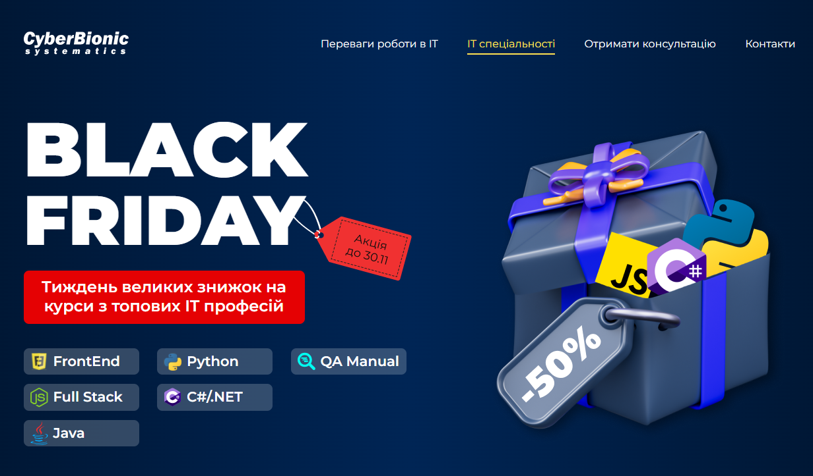

# Тренінг Верстка сайту до Чорної п'ятниці



## Опис

Це проект лендінгу для акції "Black Friday", що містить інформацію про великі знижки на курси з топових IT професій. Веб-сторінка містить секції з перевагами роботи в IT, описом IT спеціальностей, формою для отримання безкоштовної консультації.

- Макет - https://www.figma.com/design/dFqI326CZR6t3DGTb5rNXS/BF-CBS-Landing?node-id=0-1&t=bnO5NpVP5s1QoXFr-1

- Запис уроку №1: https://www.youtube.com/watch?v=PY8es7XqYHk&t=16s
- Запис уроку №2: https://www.youtube.com/watch?v=78V-uccD3js&t=923s

- https://t.me/black_friday_landing

- 🔝 Організатор: CyberBionic Systematics
- ⌛️26 та 28 листопада 2024 року
- ✅онлайн уроки з 19:00 до 21:00
- 🙋Спікер: Віталій Мазяр, FrontEnd Developer, автор відео курсів на ITVDN
- Обговорення у чаті - https://t.me/+47WXJKrPnEpkNmMy

## Посилання

- [Жива версія на GitHub Pages](https://olegbon.github.io/codeua-landing-black-friday-2024/)
- [Репозиторій на GitHub](https://github.com/OlegBon/codeua-landing-black-friday-2024)

## Встановлення

1. Клонування репозиторію:

   ```sh
   git clone https://github.com/OlegBon/codeua-landing-black-friday-2024.git
   ```

2. Перейдіть у директорію проекту:

   ```sh
   cd codeua-landing-black-friday-2024
   ```

3. Відкрийте файл `index.html` у вашому веб-браузері.

## Використані технології

- HTML5
- CSS3
- JavaScript
- [Google Fonts](https://fonts.google.com/)

## Структура проекту

```plaintext
codeua-landing-black-friday-2024/
│
├── images/
│   ├── logo.svg
│   ├── icon-frontend.svg
│   ├── icon-python.svg
│   ├── icon-qa-manual.svg
│   ├── icon-full-stack.svg
│   ├── icon-c-sharp-net.svg
│   ├── icon-java.svg
│   ├── footer-tel.svg
│   ├── footer-site.svg
│   ├── footer-tg.svg
│   ├── footer-email.svg
│   ├── arrow-to-top-page.svg
│   └── ...
│
├── styles/
│   └── style.css
│
├── script/
│   └── script.js
│
├── index.html
├── favicon.ico
├── LICENSE
└── README.md


## Автор

OlegBon

## Ліцензія

Цей проєкт ліцензується на умовах ліцензії MIT. Докладніше див. у файлі LICENSE.
```
